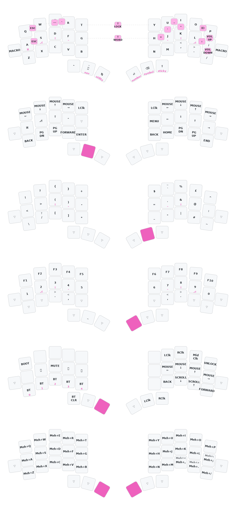

# TEMPEST: ZMK configuration

_a keymap and ZMK config for [TEMPEST](https://github.com/thrly/tempest), by @thrly_

 

## The Keyboard

See the main [TEMPEST](https://github.com/thrly/tempest) keyboard repo for hardware details.

## The Keymap

## How to build this config

1. Fork this repository.
2. `git clone` your fork, to create a local copy on your PC.
3. Personalise the [tempest.keymap](boards\shields\tempest\tempest.keymap) (see the main [ZMK docs](https://zmk.dev/docs) for help)
4. `git push` the changes to your fork
5. On the GitHub page of your fork, navigate to '/Actions'.
6. Under 'Artifacts', download and unzip the firmware.zip archive.
7. For each half of the keyboard:
   1. Connect the _left_ side of the keyboard to your PC, press the reset button twice.
   2. Your file explorer should open your keyboard's mass storage folder.
   3. Drag and drop `tempest_left-nice_nano_v2-zmk.uf2` to the MCU folder
   4. Now repeat this process for the _right_ side of Tempest with `tempest_right-nice_nano_v2-zmk.uf2`

### _Alternative_: quickstart with the pre-build keymap

If you _don't_ want to make changes to the default keymap, and you just want to quickly download and flash the default firmware:

- In the above 'How to...', skip the fork (steps 1−6) and just download the latest firmware.zip from the latest release.
- Follow the above guide (step 7) for flashing each side of the keyboard.
